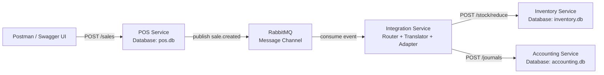

# Architecture Diagram

## Diagram Gambar

Diagram arsitektur integrasi disediakan sebagai asset terpisah di folder `diagrams/`.

File utama:

- `diagrams/integration-architecture.png`
- `diagrams/integration-architecture.svg`
- `diagrams/integration-architecture.drawio`

## Mermaid Source

Kode Mermaid di bawah ini bisa dibuka di website online seperti `https://mermaid.live` jika ingin mengubah source diagram menjadi gambar secara manual.

